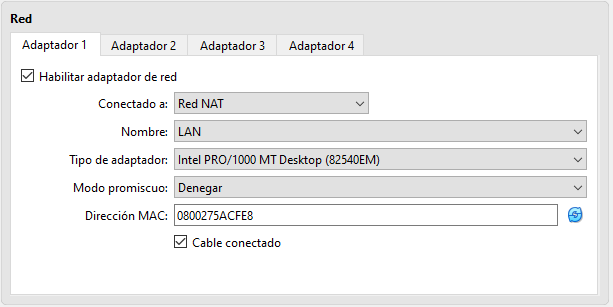
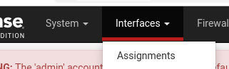
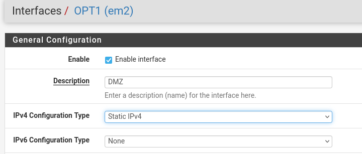

# PfSense
Nombre: Juan Felipe Criollo Valderrama
### Documentación

## creacion de redes NAT

1. vamos a herramientas y seleccionamos el menu, luego selecionamos (RED)

2. selecionamos RED NAT, luego le damos click derecho y selecionamos crear

3. cambiamos el nombre, desmaracmos el DHCP y ponemos una ip

---
   
## Instalación y configuracion de maquinas 
###  PfSense

1. Crear la maquina de pfSense y colocamos la iso

2. Configuramos la memoria  y los procesadores

3. Configuramos el almacenamiento

4. Configuracion de la red

5. iniciamos la maquina y  selecionamos Install Install pfSense

6. le damos siguiente

7. le damos siguiente

8. le damos siguiente

9. le damos espacio y siguiente

10. le damos siguiente

11. esperamos y le damos Reboot

12. se quita el disco optico para que no se vuelva reniciar la instalacion

13. Seleccionamos 
* Enter an option: 2
* Enter the number of the interface you wich to configure: 2

14. Seleccionamos
* Configure Ipv4 address LAN interface via DHCP (y/n) n
* Enter the new LAN Ipv4 address. Press <ENTER> for none:
  > 192. 168.10.1
* Enter the new LAN IPv4 subnet bit count (1 to 32):
  > 24

15. Seleccionamos
* Configure Ipv6 addres Lan interface via DHCP6 (y/n) n
* DO you  want to... LAN? (y/n) y
* Enter the start address of the IPv4... range: 192.168.10.100
* Enter the end address of the Ipv4... range: 192.168.10.200
* Do you want to revert to HTTP as th webConfigurator protocol? (y/n) y

16. ingresamos esta URL en el navegador FireFOX del Equipo001

---

### Equipo001

1. exportamos la mquina
* la seleccionamos y le damos doble clik
* le damos en terminar

2. configuramos los adaptadores de RED
* en Adaptador 1: seleccionamos RED NAT 
* en Nombre: LAN

3. configuramos el SIstema
* Procesadores: 4
* Memoria base: 2048MB

---

### Web001

1. exportamos la mquina
* la seleccionamos y le damos doble clik
* le damos en terminar

2. configuramos los adaptadores de RED
* en Adaptador 1: seleccionamos RED NAT 
* en Nombre: DMZ

3. configuramos el SIstema
* Procesadores: 2
* Memoria base: 2048M

---

## web PfSense

1. En el navegador ponemos esta IP 192.168.10.1/
* en usuario (admin) y en password (pfsense)

2. Configuramos las interfaces
* seleccionamos interfaces, luego Asignnments

3. Se añade una nueva Interfaz
* seleccionamos ADD
* Seleccionamos OPT1

4. Configuramos la nueva interfaz
* marcamos en ENABLE ENABLE INTERFACE
* cambiamos la Descripcion (DMZ)
* Seleccionamos en IPv4 Configuration type   Static IPv4

* Ponemos en IP Address (192.168.20.1) /24

5. revisamos DHCP server / lAN
* seleccionamos Services / DHCP sever

* revisamos que todos los campos

* Guardamos

6. Configuramos DHCP Server / DMZ
*  Ponemos en Address Pool Range (192.168.20.100) (192...200)

* Ponemos la ip En los DNS server (8.8.8.8, 8.8.4.4)

* Guardamos

7. Configuración de la regla NAT y reglas del firewall
* Ve a Firewall > NAT > Port Forward y crea una regla
* configuramos para que redirija el tráfico entrante en la interfaz WAN, puerto 80, Protocol TPC, Address Family IPv4,hacia la IP interna del servidor web en el puerto 80.

* Destination port range HTTP.
* Redirect target port HTTP 
* Description NAT_Redirgir Puerto 80 a Servidor Web en DMZ

* Guardamos

